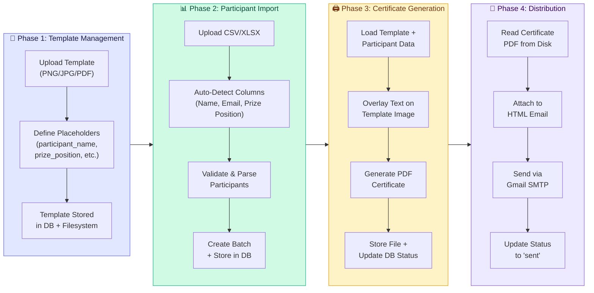
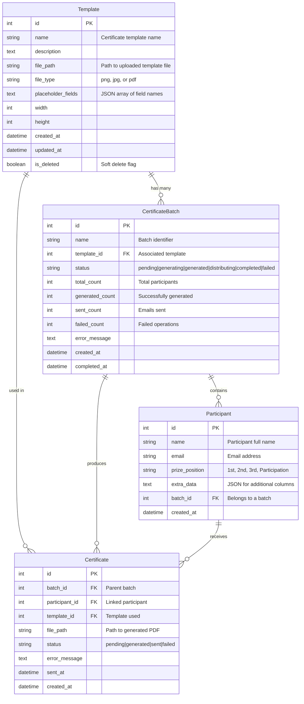
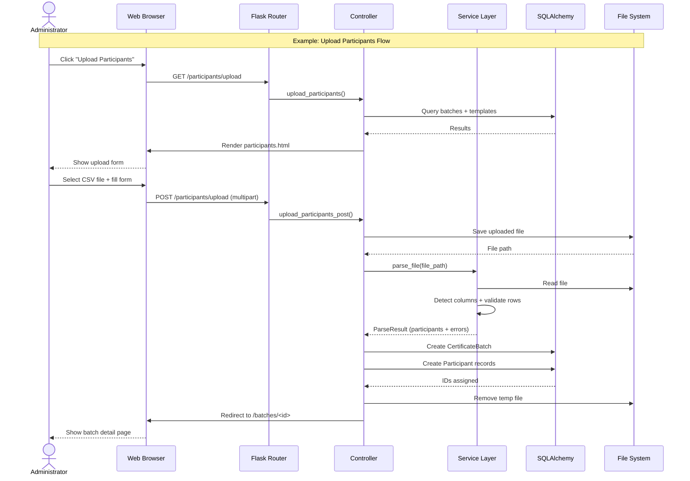
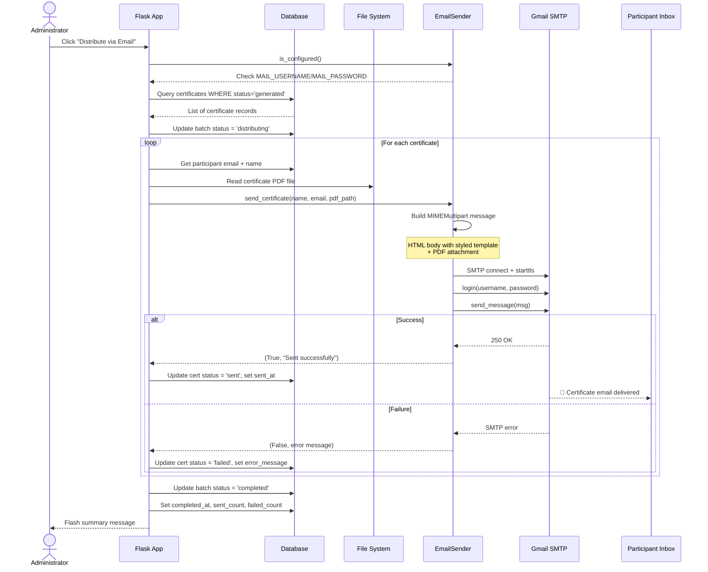
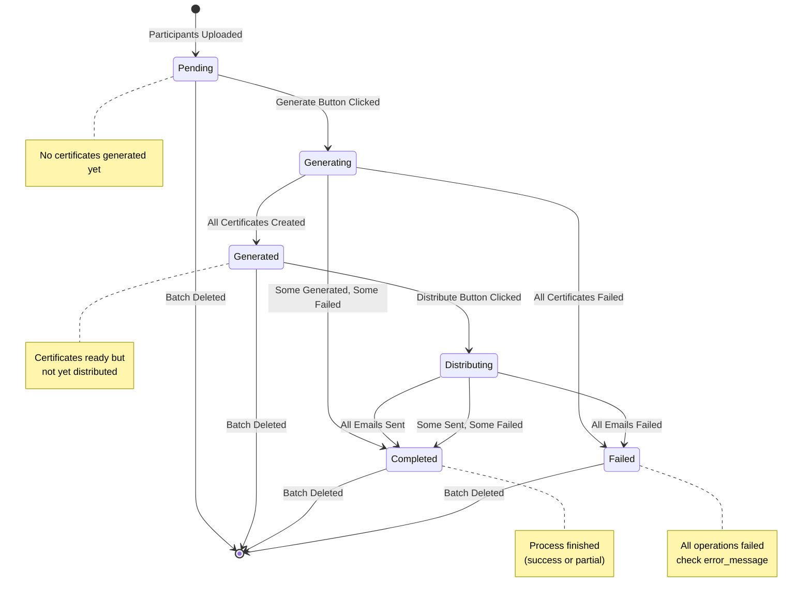

# CertiGenius Architecture

> Visual documentation of the CertiGenius platform's system architecture, data flow, and component relationships.

---

## Table of Contents

1. [High-Level System Architecture](#1-high-level-system-architecture)
2. [End-to-End Workflow](#2-end-to-end-workflow)
3. [Database Entity-Relationship Diagram](#3-database-entity-relationship-diagram)
4. [Module Dependency Graph](#4-module-dependency-graph)
5. [Request Lifecycle](#5-request-lifecycle)
6. [Certificate Generation Pipeline](#6-certificate-generation-pipeline)
7. [Email Distribution Flow](#7-email-distribution-flow)
8. [State Machine: Batch Lifecycle](#8-state-machine-batch-lifecycle)

---

## 1. High-Level System Architecture

This diagram shows how the different layers of the application interact — from the user's browser down to the file system and database.

```mermaid
graph TB
    subgraph Client["🌐 Client Layer"]
        Browser["Web Browser<br/>(Chrome/Safari/Firefox)"]
    end

    subgraph Server["🐍 Python / Flask Application"]
        direction TB
        
        subgraph Web["Web Layer"]
            Router["Flask Router<br/>(url_map)"]
            Templates["Jinja2 Templates<br/>8 HTML templates"]
            Static["Static Assets<br/>(Bootstrap 5 via CDN)"]
        end

        subgraph Controllers["Controller Layer"]
            Dashboard["Dashboard Controller"]
            TemplateCtrl["Template Controller"]
            ParticipantCtrl["Participant Controller"]
            BatchCtrl["Batch Controller"]
            CertCtrl["Certificate Controller"]
            DistCtrl["Distribution Controller"]
            API["API Endpoints<br/>(JSON)"]
        end

        subgraph Services["Service Layer"]
            ExcelParser["Excel Parser<br/>(csv + openpyxl)"]
            CertGenerator["Certificate Generator<br/>(Pillow + ReportLab)"]
            EmailSender["Email Sender<br/>(smtplib)"]
        end

        subgraph Models["Data Layer"]
            DB["SQLAlchemy ORM"]
            TemplateModel["Template Model"]
            ParticipantModel["Participant Model"]
            BatchModel["CertificateBatch Model"]
            CertModel["Certificate Model"]
        end
    end

    subgraph Storage["💾 Storage Layer"]
        SQLite[("SQLite Database<br/>certigenius.db")]
        TemplateFiles["📁 uploads/templates/"]
        ParticipantFiles["📁 uploads/participants/"]
        GeneratedCerts["📁 generated_certificates/<batch_id>/"]
    end

    subgraph External["🌍 External Integrations"]
        GmailSMTP["Gmail SMTP Server<br/>smtp.gmail.com:587"]
    end

    Browser <--> Router
    Router --> Templates
    Router --> Controllers
    Controllers --> Services
    Controllers --> Models
    Models --> DB
    DB --> SQLite
    TemplateCtrl --> TemplateFiles
    ParticipantCtrl --> ParticipantFiles
    CertGenerator --> TemplateFiles
    CertGenerator --> GeneratedCerts
    EmailSender --> GeneratedCerts
    EmailSender --> GmailSMTP
    Templates --> Static
    
    classDef layer fill:#f0f4ff,stroke:#667eea,stroke-width:2px
    classDef storage fill:#fef3c7,stroke:#d97706,stroke-width:2px
    classDef ext fill:#d1fae5,stroke:#059669,stroke-width:2px
    class Client,Server,Storage,External layer
    class SQLite,TemplateFiles,ParticipantFiles,GeneratedCerts storage
    class GmailSMTP ext
```



---

## 2. End-to-End Workflow

This diagram traces the complete user journey from start to finish, showing the four main phases of operation.



---

## 3. Database Entity-Relationship Diagram

The data model consists of four core entities. This diagram shows their relationships and key fields.



---

## 4. Module Dependency Graph

This diagram shows how the Python modules depend on each other. The `app.py` file acts as the orchestrator, tying everything together.

```mermaid
graph TD
    subgraph EntryPoints["🚀 Entry Points"]
        Run["run.py"]
    end

    subgraph CoreApp["🏗️ Core Application"]
        App["app.py<br/>(Routes & Controllers)"]
        Config["config.py<br/>(Configuration)"]
        Models["models.py<br/>(DB Models)"]
    end

    subgraph Utils["🔧 Utility Modules"]
        ExcelParser["utils/excel_parser.py<br/>CSV/XLSX Parsing"]
        CertGenerator["utils/certificate_generator.py<br/>PDF Generation"]
        EmailSender["utils/email_sender.py<br/>SMTP Email"]
    end

    subgraph Templates["🎨 HTML Templates"]
        Base["templates/base.html"]
        Dashboard["templates/dashboard.html"]
        TemplatesPage["templates/templates.html"]
        TemplateDetail["templates/template_detail.html"]
        Participants["templates/participants.html"]
        Batches["templates/batches.html"]
        BatchDetail["templates/batch_detail.html"]
        Error["templates/error.html"]
    end

    subgraph ExternalLibs["📦 External Libraries"]
        Flask["Flask"]
        SQLAlchemy["Flask-SQLAlchemy"]
        Pillow["Pillow (PIL)"]
        ReportLab["ReportLab"]
        OpenPyXL["openpyxl"]
        SMTPLIB["smtplib (stdlib)"]
        DotEnv["python-dotenv"]
    end

    Run --> App
    App --> Config
    App --> Models
    App --> TemplatesPage
    App --> Dashboard
    App --> Participants
    App --> Batches
    App --> BatchDetail
    App --> TemplateDetail
    App --> Error
    TemplatesPage --> Base
    Dashboard --> Base
    Participants --> Base
    Batches --> Base
    BatchDetail --> Base
    TemplateDetail --> Base
    Error --> Base

    App --> ExcelParser
    App --> CertGenerator
    App --> EmailSender

    ExcelParser --> OpenPyXL
    CertGenerator --> Pillow
    CertGenerator --> ReportLab
    EmailSender --> SMTPLIB
    App --> Flask
    App --> SQLAlchemy
    App --> Config
    Models --> SQLAlchemy
    Config --> DotEnv
    
    classDef entry fill:#10b981,stroke:#059669,color:white
    classDef core fill:#667eea,stroke:#5a6fd6,color:white
    classDef util fill:#f59e0b,stroke:#d97706,color:white
    classDef template fill:#f472b6,stroke:#db2777,color:white
    classDef lib fill:#6b7280,stroke:#4b5563,color:white
    class Run entry
    class App,Config,Models core
    class ExcelParser,CertGenerator,EmailSender util
    class Base,Dashboard,TemplatesPage,TemplateDetail,Participants,Batches,BatchDetail,Error template
    class Flask,SQLAlchemy,Pillow,ReportLab,OpenPyXL,SMTPLIB,DotEnv lib
```



---

## 5. Request Lifecycle

When a user interacts with the web interface, here is the path a request follows through the system.



---

## 6. Certificate Generation Pipeline

The core of the platform — how participant data and templates combine to produce PDF certificates.

```mermaid
flowchart TB
    Start(["Generate Button Clicked"]) -->
    LoadBatch["Load Batch & Template<br/>from Database"]

    LoadBatch --> CheckTemplate{"Template<br/>Exists?"}
    CheckTemplate -->|"No"| FlashError["Flash Error Message<br/>'Template not found'"]
    CheckTemplate -->|"Yes"| LoadTemplateFile["Load Template File<br/>from uploads/templates/"]

    LoadTemplateFile --> CheckType{"Template<br/>Type?"}

    CheckType -->|"PNG/JPG"| ImagePipeline["Image Template Pipeline"]
    CheckType -->|"PDF""> PDFPipeline["PDF Template Pipeline"]

    subgraph ImagePipeline["🖼️ Image Template Pipeline"]
        direction TB
        I1["Open with Pillow<br/>Image.open()"] -->
        I2["Convert to RGBA"] -->
        I3{"Placeholders<br/>Defined?"}
        I3 -->|"Yes"| I4["Use Predefined Positions<br/>(x, y, font_size, color)"]
        I3 -->|"No"| I5["Auto-Position Text<br/>(smart layout algorithm)"]
        I4 --> I6["Draw text on overlay<br/>ImageDraw.text()"]
        I5 --> I6
        I6 --> I7["Alpha composite<br/>template + overlay"]
        I7 --> I8["Save as PDF<br/>(300 DPI)"]
    end

    subgraph PDFPipeline["📄 PDF Template Pipeline"]
        direction TB
        P1["Create ReportLab<br/>Canvas (Landscape)"] -->
        P2["Set Fonts: Helvetica-Bold<br/>for participant_name"] -->
        P3["Calculate text widths<br/>for center alignment"] -->
        P4["Draw strings at<br/>predefined Y positions"] -->
        P5["Save PDF"]
    end

    ImagePipeline --> StoreCert["Save PDF to<br/>generated_certificates/<batch_id>/"]
    PDFPipeline --> StoreCert

    StoreCert --> CreateDBRecord["Create Certificate DB Record<br/>with file_path + status='generated'"]
    
    CreateDBRecord --> LoopCheck{"More<br/>Participants?"}
    LoopCheck -->|"Yes"| LoadTemplateFile
    LoopCheck -->|"No"| UpdateBatch["Update Batch Status<br/>generated_count + failed_count"]
    
    UpdateBatch --> Redirect["Redirect to<br/>Batch Detail Page"]

    subgraph DataPrep["📋 Data Preparation"]
        D1["Participant Data:<br/>name, email, prize_position"]
        D2["Extra Data from CSV:<br/>additional columns"]
        D3["Template Placeholders:<br/>field names to populate"]
        D1 --> Merge["Merge into single<br/>data dictionary"]
        D2 --> Merge
        D3 --> Filter["Filter to only<br/>placeholder fields"]
        Filter --> Merge
    end

    DataPrep --> ImagePipeline
    DataPrep --> PDFPipeline

    style ImagePipeline fill:#fef3c7,stroke:#f59e0b
    style PDFPipeline fill:#e0e7ff,stroke:#6366f1
    style DataPrep fill:#d1fae5,stroke:#10b981
```

---

## 7. Email Distribution Flow

How certificates are delivered to participants via Gmail SMTP.



---

## 8. State Machine: Batch Lifecycle

A batch goes through several states during its lifecycle. This diagram shows all possible transitions.



---

## Summary

CertiGenius follows a **modular MVC-inspired architecture**:

| Layer | Responsibility | Key Files |
|---|---|---|
| **View** | HTML rendering with Jinja2 | `templates/*.html` |
| **Controller** | Route handlers, request processing | `app.py` |
| **Service** | Business logic (parsing, generation, email) | `utils/*.py` |
| **Model** | Database schema and relationships | `models.py` |
| **Storage** | SQLite database + filesystem | `certigenius.db`, `uploads/`, `generated_certificates/` |

The system processes data in a **linear pipeline** — templates and participant data flow forward through generation into distribution, with status tracking at every step.
